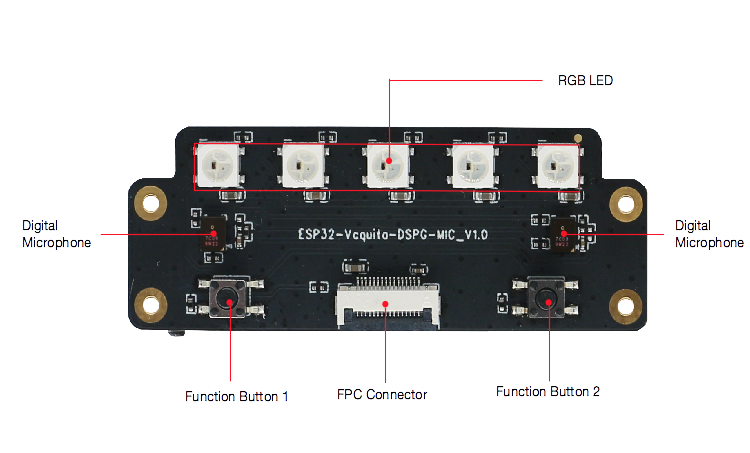
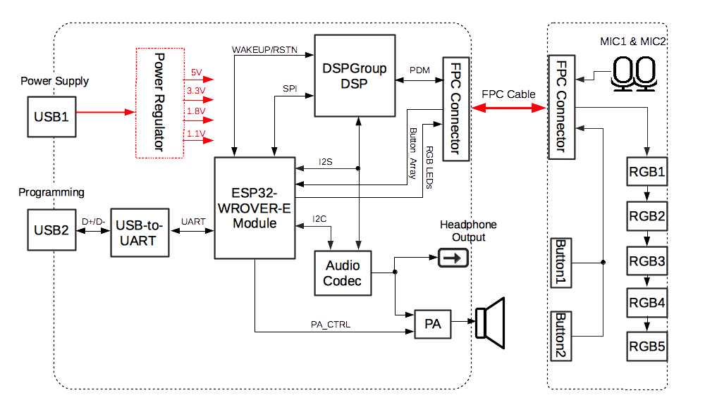

# ESP32-Vaquita-DSPG User Guide

* [中文版](../../../zh_CN/hw-reference/esp32/user-guide-esp32-vaquita-dspg.md)

This user guide provides information on ESP32-Vaquita-DSPG.

The ESP32-Vaquita-DSPG development board, together with *Alexa Voice Service (AVS) for AWS IoT*, provides a turnkey solution to easily create Alexa built-in IoT devices, which features voice enablement and AWS IoT cloud connectivity.

The document consists of the following major sections:

- [Getting started](#getting-started): Provides an overview of ESP32-Vaquita-DSPG and hardware/software setup instructions to get started.
- [Hardware reference](#hardware-reference): Provides more detailed information about the ESP32-Vaquita-DSPG's hardware.
- [Related Documents](#related-documents): Gives links to related documentaiton.

# 1. Getting Started

This section describes how to get started with ESP32-Vaquita-DSPG. It begins with a few introductory sections about ESP32-Vaquita-DSPG, then Section [Start Application Development](#start-application-development) provides instructions on how to do the initial hardware setup and then how to flash firmware into ESP32-Vaquita-DSPG.

## 1.1 Overview

The ESP32-Vaquita-DSPG development board offers an easy, secure and cost-effective way to develop voice-controlled IoT devices. This development board contains Espressif's ESP32 wireless SoC, DSP Group's DBMD5P audio SoC, and a two-mic array with 360-degree pickup, with which you can easily develop Alexa built-in IoT devices with seamless voice integration and cloud connectivity.

## 1.2  Contents and Packaging

### 1.2.1 Retail orders

If you order one or several samples, each ESP32-Vaquita-DSPG comes in an individual package which would contain:
* ESP32-Vaquita-DSPG mainboard
* ESP32-Vaquita-DSPG Mic board
* FPC cable

For retail orders, please go to <https://www.espressif.com/en/company/contact/buy-a-sample>.

### 1.2.2 Wholesale Orders

If you order in bulk, the baords come in large cardboard boxes.

For wholesale orders, please check [Espressif Product Ordering Information](https://www.espressif.com/sites/default/files/documentation/espressif_products_ordering_information_en.pdf) (PDF).

## 1.3 Description of Components

|Key Componenet|Description|
|:- |:- |
|ESP32-WROVER-E|This ESP32 module contains the latest ESP32-D0WD-V3, a 64 Mbit SPI flash and a 64 Mbit PSRAM for flexible data storage, featuring Wi-Fi / BT connectivity and data processing capability.|
|DBMD5P Audio SoC|This SoC features superior far-field voice recognition fulfilled by its HDClear™ algorithms.|
|Power Regulator| 5V-to-3.3V regulator.|
|USB Power Port| Supply power to the board.|
|USB-UART Port|A communication interface between a computer and the board.|
|Power On LED|Red LED indicates that the board is powered on.|
|USB-to-UART Bridge|Single USB-UART bridge chip provides transfer rates of up to 3 Mbps.|
|Boot Button| Download button. Holding down Boot and then pressing EN initiates Firmware Download mode for downloading firmware through the serial port.|
|Reset Button|Pressing this button resets the system.|
|Audio PA|Amplify audio signals to external speaker at maximum 8 W.|
|Audio Codec|Audio codec ES8311 communicates with ESP32 via the I2S bus, which converts digital signals to analog signals.|
|Speaker Connector|Connect an external speaker.|
|Earphone Connector|Connect an external earphone.|
|FPC Connector|Connect mainboard and subboard.|
|Digital Microphone|Two digital microphone arrays.|
|RGB LED|Five RGB LEDs.|
|Function Button|Two function buttons.|
  
## 1.4 Start Application Development

Before powering up your ESP32-Vaquita-DSPG, please make sure that it is
in good condition with no obvious signs of damage.

### 1.4.1 Required Hardware

* ESP32-Vaquita-DSPG
* 2 x USB 2.0 cable (Standard-A to Micro-B)
* 4-ohm speaker or earphones  
* Computer running Windows, Linux, or macOS

### 1.4.2 Hardware Setup

1. Connect ESP32-Vaquita-DSPG Mic board to ESP32-Vaquita-DSPG mainboard through the FPC cable.
2. Connect a 4-ohm speaker to the Speaker Connector, or connect earphones to the Earphone Connector.
3. Plug in the USB cables to the PC and to both USB ports of ESP32-Vaquita-DSPG.
4. The Power On LED (Red) should turn on.

### 1.4.3 Software Setup

While this board can be used for variety of applications, one of the primary applications is to support "Alexa Voice Service (AVS) for AWS IoT" use cases. You can download Espressif's [AVS for AWS IoT SDK](https://github.com/espressif/esp-va-sdk/tree/feature/aia-beta) and follow the [instructions](https://github.com/espressif/esp-va-sdk/blob/feature/aia-beta/README.md).

# 2. Hardware Reference

## 2.1 Block Diagram

A block diagram below shows the components of ESP32-Vaquita-DSPG and their interconnections.

# 3. Related Documents

* [ESP32-Vaquita-DSPG Mainboard Schematics](https://dl.espressif.com/dl/schematics/ESP32-VAQUITA-DSPG_V1.0_schematics.pdf) (PDF)
* [ESP32-Vaquita-DSPG Mic Schematics](https://dl.espressif.com/dl/schematics/ESP32-VAQUITA-DSPG-MIC_V1.0_schematics.pdf) (PDF)
* [ESP32 Datasheet](https://www.espressif.com/sites/default/files/documentation/esp32_datasheet_en.pdf) (PDF)
* [Espressif Product Ordering Information](https://www.espressif.com/sites/default/files/documentation/espressif_products_ordering_information_en.pdf) (PDF)
